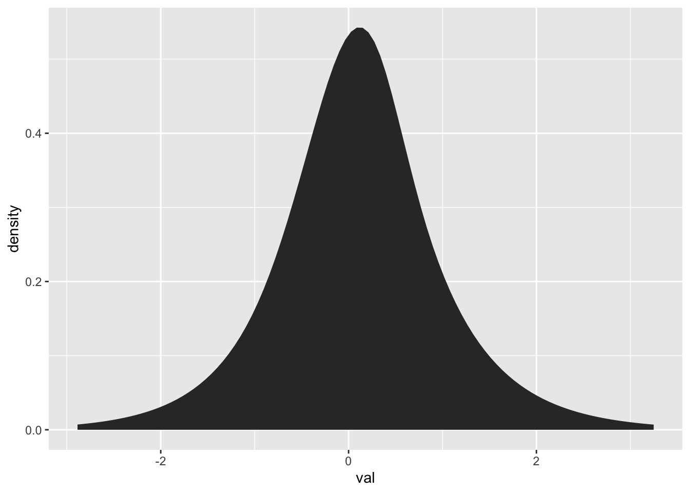
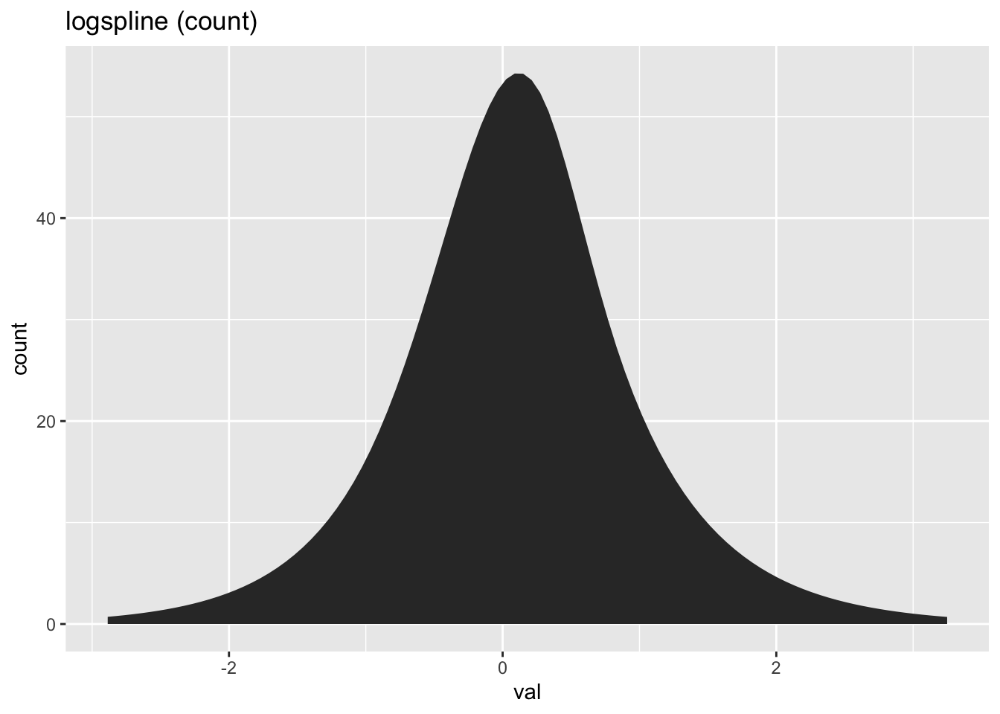
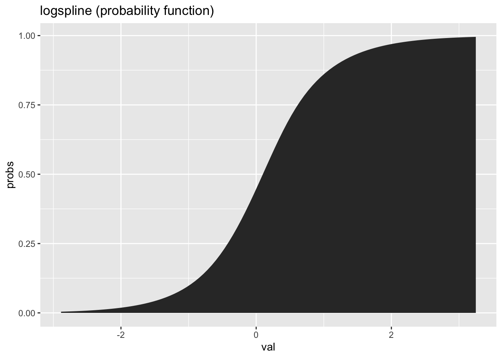
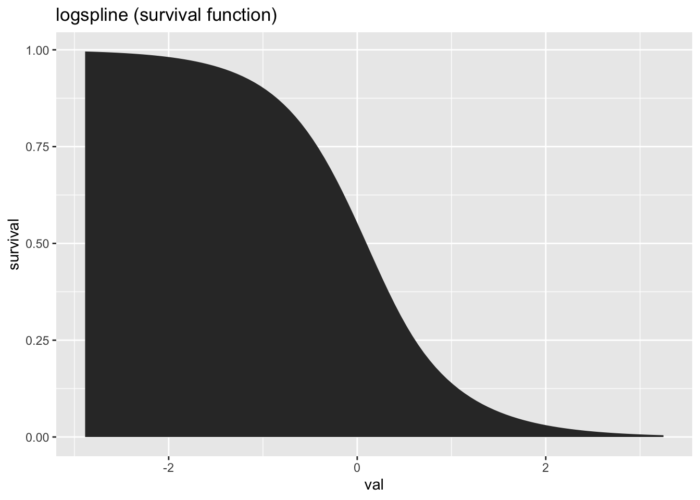
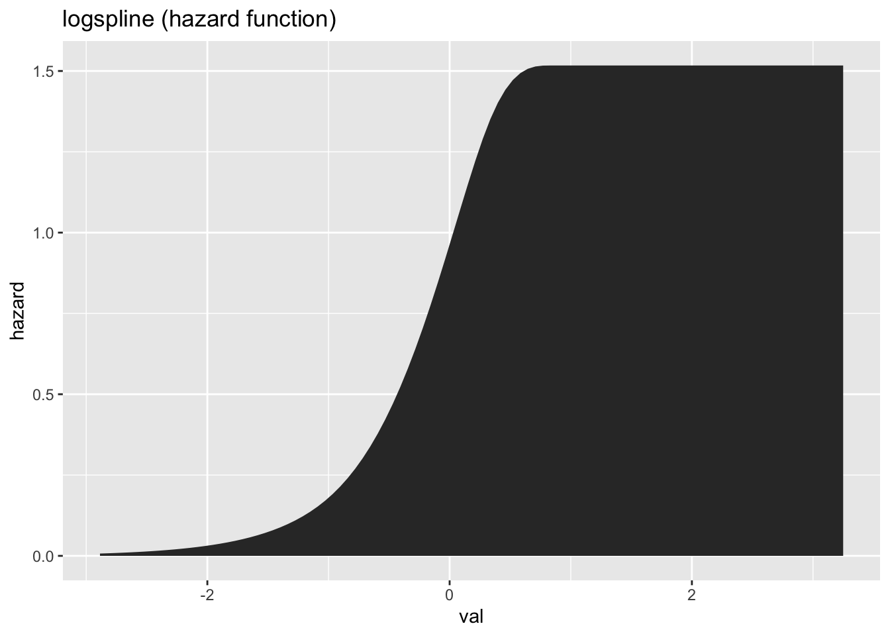

[](https://travis-ci.org/hrbrmstr/gglogspline)
[](https://codecov.io/gh/hrbrmstr/gglogspline)
[](https://cran.r-project.org/package=gglogspline)

# gglogspline

A ‘ggplot2’ Extension for Visualizing Density, Distribution, Hazard, or
Survival Functions using the ‘logspline’ Package

## Description

Methods are provided to plot a logspline density, distribution function,
hazard function or survival function from a logspline density

## What’s Inside The Tin

The following functions are implemented:

## Installation

``` r
devtools::install_git("https://git.sr.ht/~hrbrmstr/gglogspline.git")
# or
devtools::install_git("https://git.rud.is/hrbrmstr/gglogspline.git")
# or
devtools::install_gitlab("hrbrmstr/gglogspline")
# or
devtools::install_bitbucket("hrbrmstr/gglogspline")
# or
devtools::install_github("hrbrmstr/gglogspline")
```

## Usage

``` r
library(gglogspline)
library(ggplot2)

# current version
packageVersion("gglogspline")
## [1] '0.1.0'
```

``` r
set.seed(1)
data.frame(
  val = rnorm(100)
) -> xdf

ggplot(xdf) + 
  stat_logspline(aes(val))
```



``` r

ggplot(xdf) + 
  stat_logspline(aes(val, y = stat(count))) +
  labs(title = "logspline (count)")
```



``` r

ggplot(xdf) +
  stat_logspline(aes(val, y = stat(probs))) +
  labs(title = "logspline (probability function)")
```



``` r

ggplot(xdf) +
  stat_logspline(aes(val, y = stat(survival))) +
  labs(title = "logspline (survival function)")
```



``` r

ggplot(xdf) +
  stat_logspline(aes(val, y = stat(hazard))) +
  labs(title = "logspline (hazard function)")
```



## gglogspline Metrics

| Lang | \# Files | (%) | LoC |  (%) | Blank lines |  (%) | \# Lines | (%) |
| :--- | -------: | --: | --: | ---: | ----------: | ---: | -------: | --: |
| R    |        4 | 0.8 |  63 | 0.67 |          20 | 0.47 |       53 | 0.6 |
| Rmd  |        1 | 0.2 |  31 | 0.33 |          23 | 0.53 |       35 | 0.4 |

## Code of Conduct

Please note that this project is released with a [Contributor Code of
Conduct](CONDUCT.md). By participating in this project you agree to
abide by its terms.
